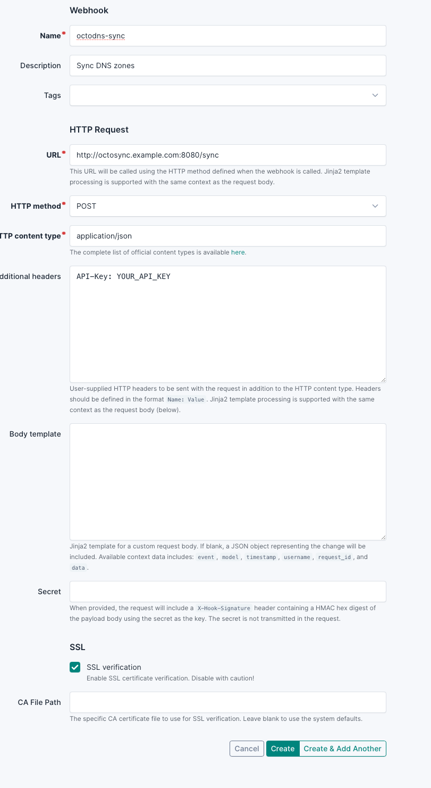
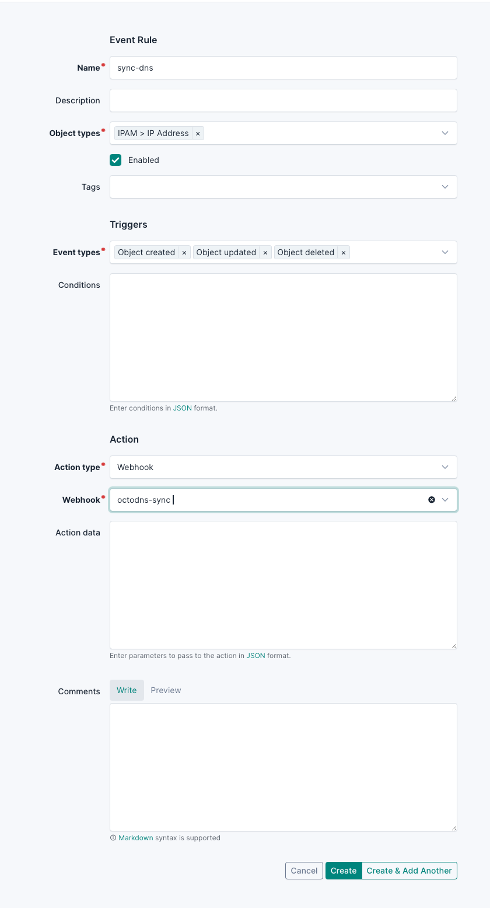

# octodns-webhook-listener

This is a simple flask app, which exposes [Octo-dns](https://github.com/octodns/octodns) as a webhook.
My goal is, that when I add a new DNS entry in [netbox](https://github.com/netbox-community/netbox), the DNS entry should be automaticlly be created on the DNS server.

# ToDo

- [ ] Use docker volumes instead of copying files


# How to get this thing running

## Requirements

1. A working [netbox](https://github.com/netbox-community/netbox) installation
2. A domain with nameservers of one of the [providers supported by octo-dns](https://github.com/octodns/octodns?tab=readme-ov-file#providers)

## Config

1. add a yaml file for your domain to the `domains` folder. Configure the default values for your domain, that are not managed by netbox (eg. MX records.)
> IMPORTANT: All DNS records will be lost, if not present in netbox or the yaml file! Consider using [`octodns-dump`](https://github.com/octodns/octodns/blob/main/examples/migrating-to-octodns/README.md) to create the inital config.
2. Edit the `config.yaml` file according to your needs. Currently it's configured to get the data from the yaml file & netbox and push it to digital ocean. [How to configure a basic setup](https://github.com/octodns/octodns/tree/main/examples/basic)
3. If you use a different provider, make sure you add the module to `requirements.txt`
4. Rename `.env.dist`to `.env`and fill in the values. Generate the tokens from your DNS provider & netbox. For `NETBOX_HOST`enter the FQDN of your netbox instance (eg. `netbox.example.com`). For the API Key use a random string. Netbox will use it to authenticate to the flask app.
5. Build the conainter `docker build -t octodns-webhook .`
6. Run it: `docker run -d --name octodns-webhook --env-file .env -p 8080:8080 octodns-webhook`


# Test

To test the container locally, execute the following command:
```shell
curl -X POST http://localhost:8080/sync -H "API-Key: YOUR_API_KEY"
```

# Add to netbox

Navigate to `Operations => Webhooks`and add a new webhook like this:


After that add an event to trigger the webhook:

